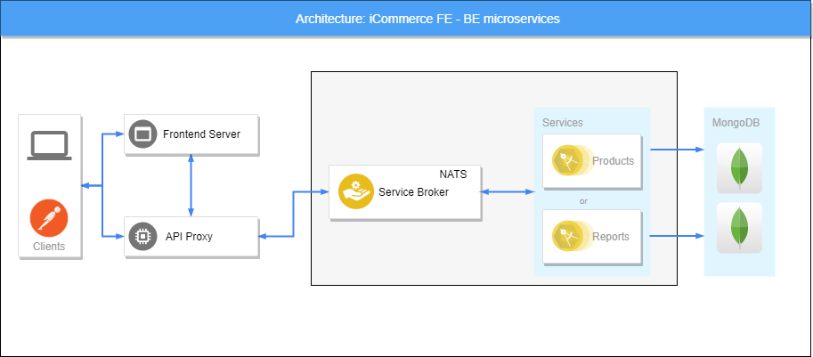

### Reference
* Nodejs
* Mongodb
* Reactjs
* Redux/Saga
* Axios
* MUI
* React Hooks
* Docker / Compose
* Moleculer
* Nginx
* Swagger
* Postman
* NATS
* Jest

### Overview



### Summary ###

* Prerequisites
* Start
* Testing
* Postman
* Swagger

### Prerequisites

* Docker / Docker compose
* Nodejs 12 or above

### Start 
Run backend first

```
cd server/docker/micro
docker-compose up --build -d
# default address: localhost:3000
```

Run frontend after backend is up and running

```
cd client/
docker-compose up --build -d
# default address: localhost:3001
```

### Testing
I use Jest for testing
```
cd server/
npm run test
```

or

```
cd server/docker/test
docker-compose up 
```

### Postman

Import Postman collection in folder 'server/postman' to see how to test requests

### Swagger

Use swagger extension in vscode or online swagger to view api definitions
